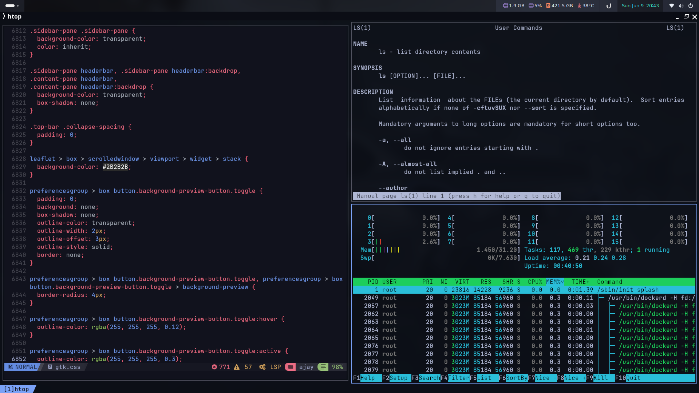
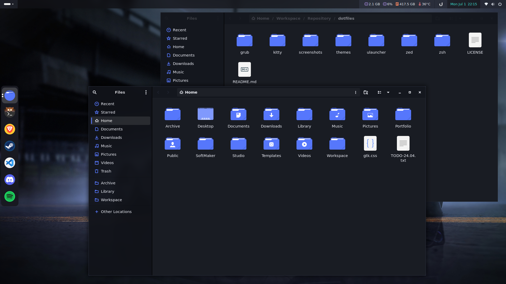

# Dotfiles
> Configuration files for my Linux desktop setup

## Screenshots

## Wallpaper

[Click Here](https://wallscloud.net/en/wallpaper/cars/over-cars/cyberpunk-car/1l2V) to download wallpaper.

